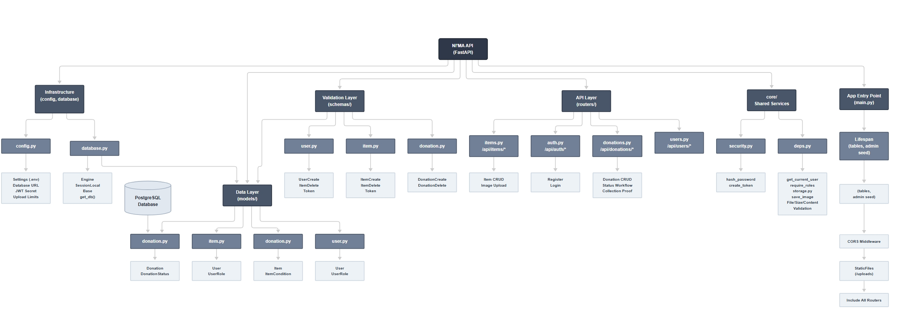

  
   
  <em>What is no longer useful to you may be valuable to someone else.</em>
    
  <strong>NI'MA — FastAPI Backend</strong>
   
  <a href="https://github.com/MuneeraAlmajed/ni-ma-frontend">View the Frontend →</a>

NI’MA is a web-based platform that helps people in Bahrain give unwanted but still useful items a second life by connecting Clients who want to donate items with Collectors who handle their collection.

## Key Features
- 🔐 User Authentication and Authorization
- 👥 Role Based Access Control
- 📦 Item Management
- 🤝 Donation Management
- 📋 Donation Status Tracking
- 🚚 Collector Management
- 📸 Collection Proof
- 🛡️ Admin Dashborad
- 🔄 RESTFul CRUD APIs
- 🗄️ PostgreSQL Database
- 📖 API Documentation 

## Sreenshot of NI'MA 

## Live Demo 
🔗 [Visit NI'MA]

## User Stories

### Authentication and Accounts (all roles)
1. As a visitor, I want to register as a Client or Collector, so that I can use the platform.
2. As a user, I want to log in and receive a secure token (JWT), so that my session is protected.
3. As a user, I want to view and edit my profile (name, phone, area), so that my details stay accurate.
4. As a user, I want to reset my password, so that I can regain access if I forget it.

### Client (donor)
1. As a client, I want to add an item with its name, category, condition and description, so that I can offer it for donation.
2. As a client, I want to attach a photo to my item, so that collectors can see what it looks like.
3. As a client, I want to edit or delete my items before they are collected, so that I can fix mistakes or change my mind.
4. As a client, I want to sumbit a donation request with my pickup address and preferred time, so that a collector can come and get the item. 
5. As a client, I want to track my donation status (pending, assigned, collected, completed), so that I know what is happening.
6. As a client, I want to see all my past and current donations, so that I have a record of what I gave.
7. As a client, I want to cancel a donation that is still pending, so that I am not commited if my plans change.

### Collector
1. As a collector, I want to see the donations assigned to me with their item details, address and pickup time, so that I can plan my route.
2. As a collector, I want to browser pending donations in my area and rrequest to take them, so that I can pickup more items.
3. As a collector, I want to upload a photo as a proof of collection, so that the pickup is verified.
4. As a collector, I want to report a failed pickup with a reason. 

### Admin
1. As a admin, I want to view, activate, deactive or delete users, so that I can keep the platform safe.
2. As a admin, I want to view all the items and dontaions with filters (status, category, date), so that I can monitor activity.
3. As an admin, I want to assign a pending donation to a collector, so that every request gets handled.
4. As an admin, I want to review collection proof photos and approve or reject them,, so that I can confirom the donation actually happened.
5. As an admin, I want to mark an approved donation as completed, so that the process closes properly.
6. As an admin, I want to remove inappropriate donations, so that the platform stays clean.
7. As an admin, I want a simple  dashboard (total donations, completed, pending, top categories), so that I can see the platform impact.

### System and Security
1. As the system, I want to enforce role-based access, so that a client cannot see another client's data and a collector cannot see unassigned donations.
2. As the system, I want to allow only valid status transitions (pending → assigned → collected → completed), so that the data stays consistent.
3. As the system, I want to validate all input (Pydantic) and limit upload file type and size, so that bad or unsafe data is rejected.

## WireFrame
The main wireframes represent the core user journeys and role-based dashboards of NI’MA.

[View the NI'MA Wireframes on Excalidraw](https://excalidraw.com/#json=9SUurKkLgBeb_STEJbZyB,D1y8F7jMOhDz4KHR5wKu4g)

## ERD

## Backend Routes

### Authentication
| Method | Route | Access | Description |
|--------|-------|--------|-------------|
| POST | `/api/auth/register` | Public | Register as client or collector |
| POST | `/api/auth/login` | Public | Login (form data: `username` = email, `password`), returns JWT |
| GET | `/api/auth`  | Any | Get my profile |
| PUT | `/api/auth`  | Any | Update my name, phone, or area |

### Items
| Method | Route | Access | Description |
|--------|-------|--------|-------------|
| POST | `/api/items`  | Client | Create an item |
| GET | `/api/items`  | Client, Admin | List items (client: own, admin: all). Filters: `category`, `condition`, `is_available` |
| GET | `/api/items/{id}`  | Client (owner), Admin | Get one item |
| PUT | `/api/items/{id}`  | Client (owner) | Update an item (blocked while it has an active donation) |
| POST | `/api/items/{id}/image`  | Client (owner) | Upload item photo |
| DELETE | `/api/items/{id}`  | Client (owner), Admin | Delete an item |

### Donations
| Method | Route | Access | Description |
|--------|-------|--------|-------------|
| POST | `/api/donations`  | Client | Submit a donation request for an available item |
| GET | `/api/donations`  | Any | List donations by role (client: own, collector: assigned, admin: all). Filter: `status_filter` |
| GET | `/api/donations/{id}`  | Client (owner), assigned Collector, Admin | Get donation details |
| PUT | `/api/donations/{id}`  | Client (owner) | Update pickup address or time (pending only) |
| DELETE | `/api/donations/{id}/cancel`  | Client (owner) | Cancel (pending → cancelled) |
| PUT | `/api/donations/{id}/assign`  | Admin | Assign collector (pending → assigned). Body: `collector_id` |
| PUT | `/api/donations/{id}/collect`  | Assigned Collector | Mark collected (assigned → collected) |
| POST | `/api/donations/{id}/proof`  | Assigned Collector | Upload proof photo (collected only) |
| PUT | `/api/donations/{id}/review`  | Admin | Approve or reject proof. Body: `approved`, `note` |
| PUT | `/api/donations/{id}/complete`  | Admin | Complete (collected → completed, proof must be approved) |
| DELETE | `/api/donations/{id}`  | Admin | Delete a donation |

### Users (Admin)
| Method | Route | Access | Description |
|--------|-------|--------|-------------|
| GET | `/api/users`  | Admin | List users. Filter: `role` |
| GET | `/api/users/{id}`  | Admin | Get one user |
| POST | `/api/collectors` | Admin | Create a new collector |
| PUT | `/api/users/{id}/status`  | Admin | Activate or deactivate. Body: `is_active` |
| DELETE | `/api/users/{id}`  | Admin | Delete a user (only if no donations on record) |
| GET | `/api/collectors`  | Admin | List active collectors for assignment |

## Component Hirerachy 

## Attributions

## Technologies Used

## Future Work

